logging some Vishay VHD202Z hermetically sealed Z-foil resistors.

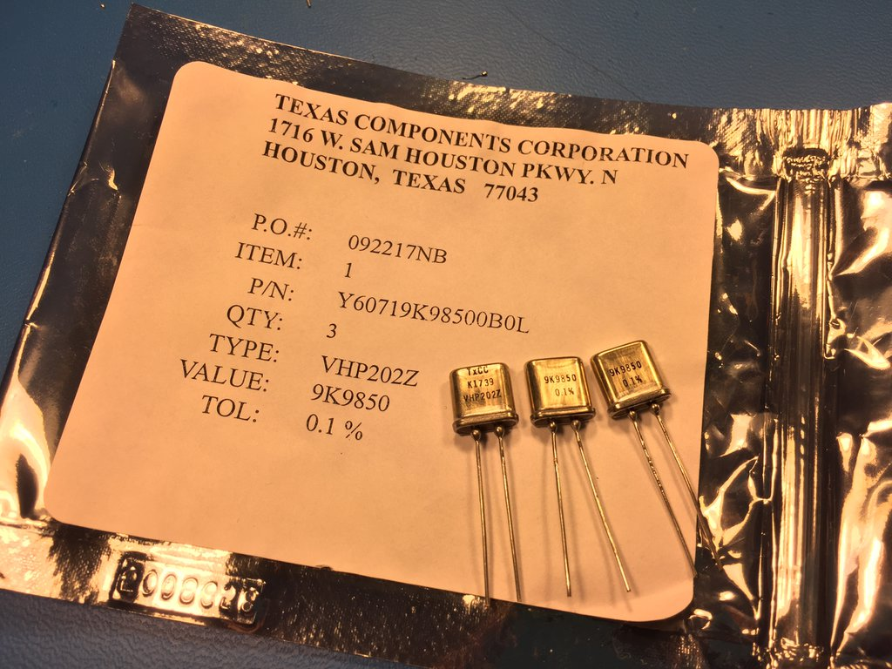

## run 1: 9K9850 #1

10 steps of 1C, 5 minutes per step.

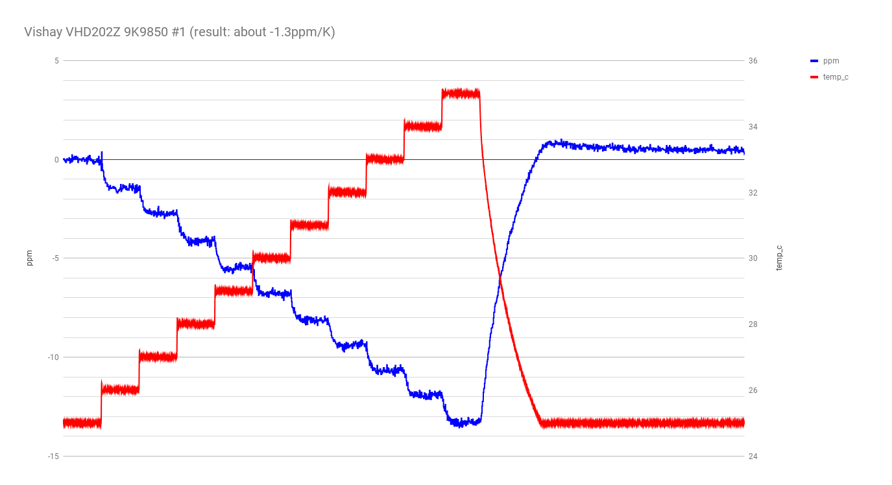

-1.3ppm/K?  Are you kidding me?  This is disappointing to say the least.  So much for 0.2ppm/C.  http://www.vishaypg.com/docs/63120/hzseries.pdf

## run 2: 9K9850 #1, with maximum possible lead length

Let's see what the effect of lead length is on the tempco.

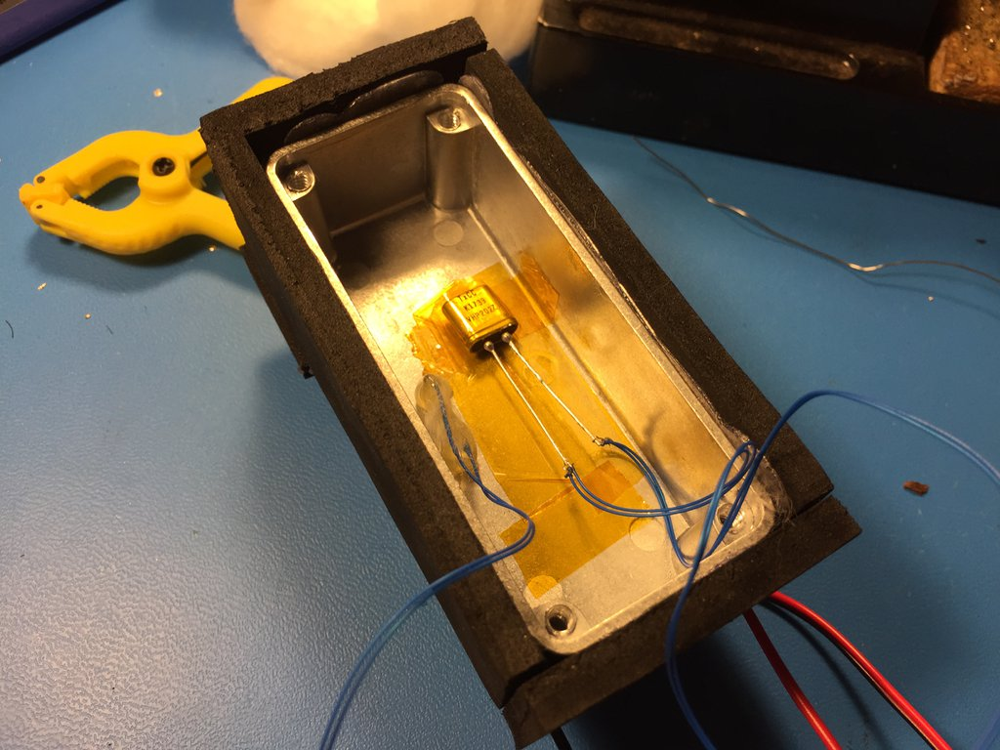

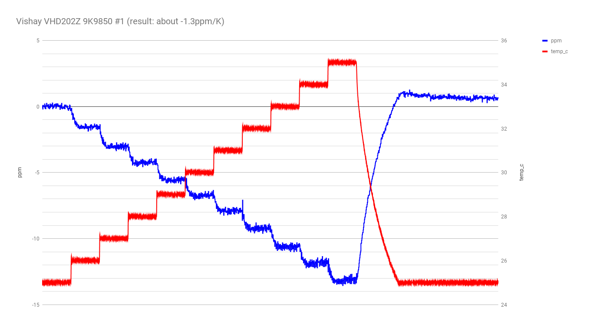

no apparent difference.

## run 3: 9K9850 #2

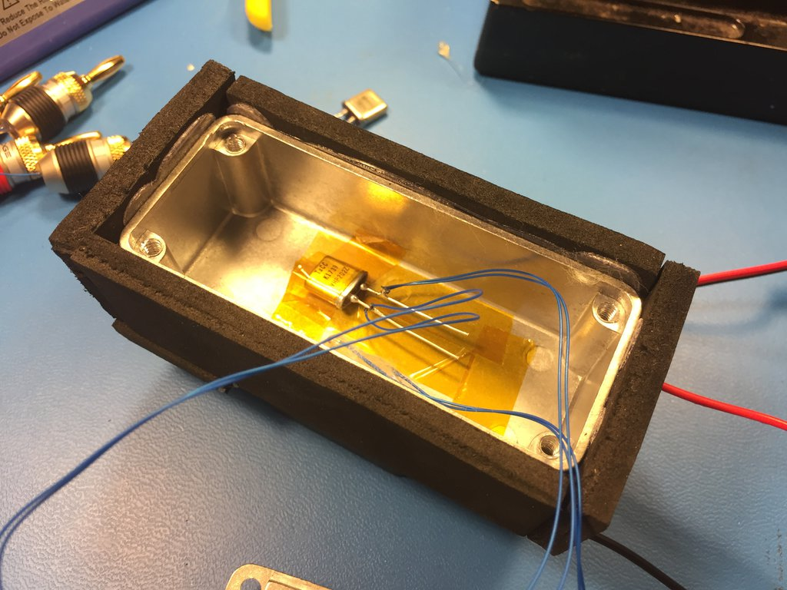

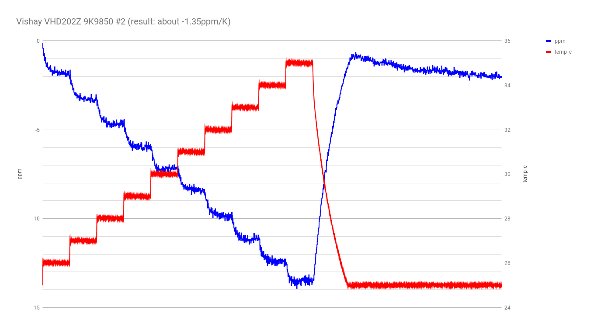

Bummer, this one is just as bad: -1.35ppm/K.

Looks like I made a mistake and truncated the lead-in data.  The chart starts at the jump from 25C to 26C.

## run 4: 9K9850 #3

testing the third 9K9850.  this was a quick run (2 minutes per C).  I want to get through the rest of these resistors quickly to see if they are all ~1.3ppm/K.

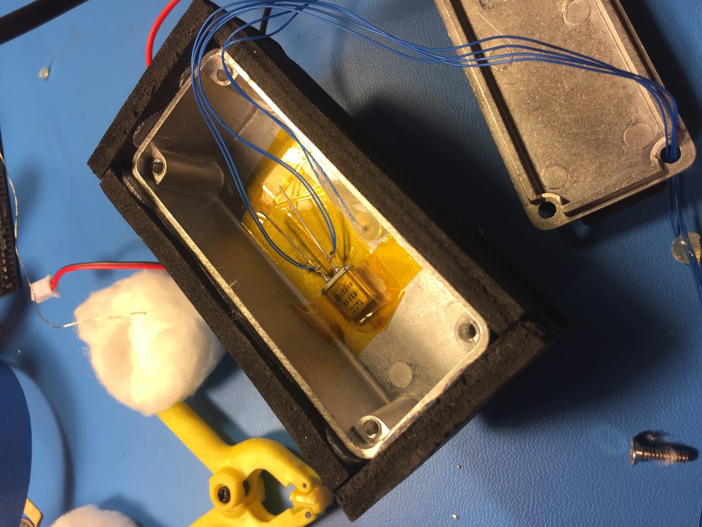

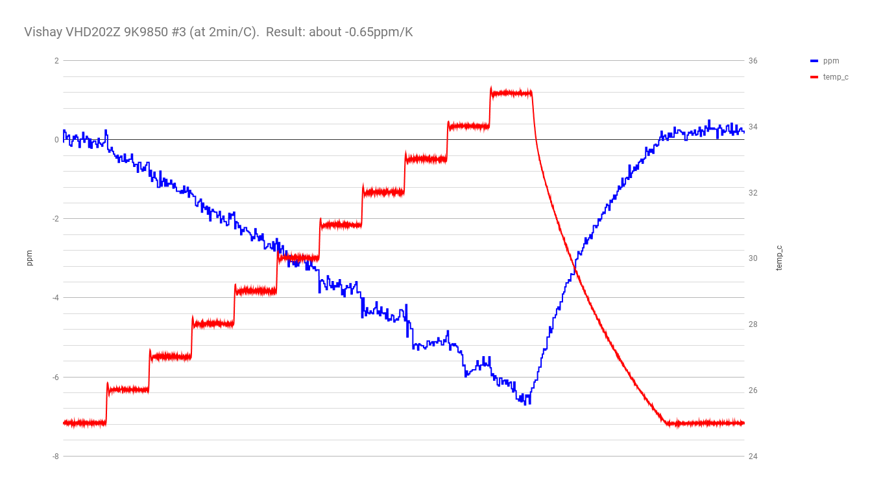

Looks like -0.65ppm/K.

## run 5: 9K9850 #3

repeating the 9K9850 resistor #3 but at 5min/C.

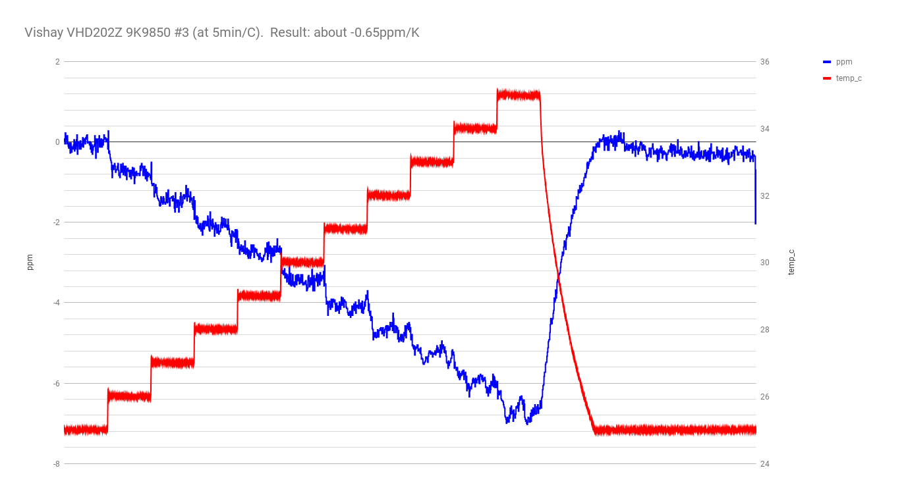

## run 6: 19K980 #1

I also have three VHP202Z 19K980 resistors.  Here's the first.  5min/C.

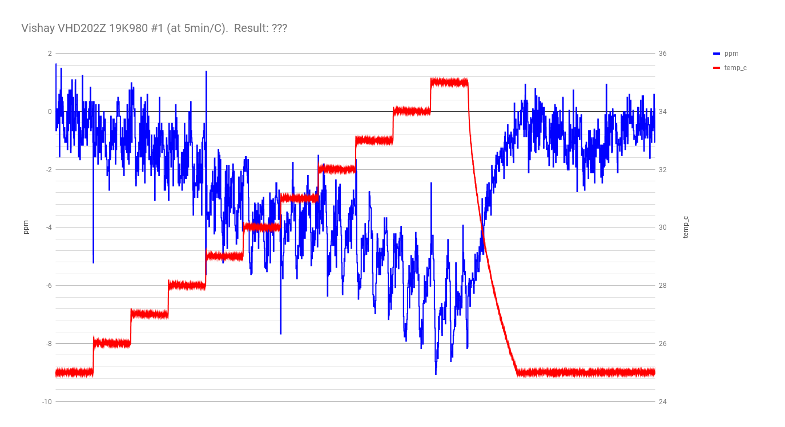

whoa, yuck, that is terribly noisy.  perhaps a bad solder joint?

## run 7: 19K980 #2

5min/C.

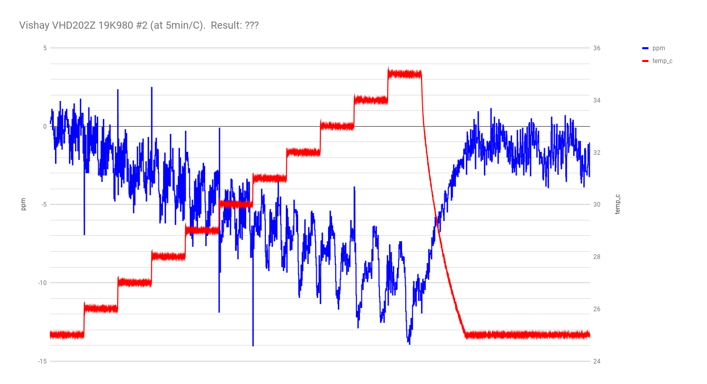

ugh, another grabage result.  where is all of this noise coming from all of a sudden?

## run 8: 19K980 #2

I unplugged a laptop adapter which was on the same circuit as my HP34401A (perhaps there is an EMI problem on the 120V line?).  Repeating the same run.  5min/C.

oh wait, I just realized I jumped to a different resistance range when I moved from 10k to 20k resistors.  I'm now at the bottom of the next range, using only 20% of the ADC's range.
