To evaluate the performance of my meter, I'll just log a VHP202Z for several hours.  My suspicion is that the "noise" issue I'm seeing is simply due to the fact that a 20k resistor only occupies the bottom 20% of the ADC's range, so when that signal gets scaled up in a graph, the resulting tempco looks very "noisy".

I'll make sure I keep the ppm scale the same across all of these charts (+2ppm to -2ppm).

## run 1: 19k970 #3

testing VHP202Z 19K970 #3, soldered using very short 4-wire leads. 

connectors are [Cinch 108-0753-102](https://www.digikey.com/product-detail/en/cinch-connectivity-solutions-johnson/108-0753-102/J10108-ND/565813).  wire is 24 AWG cat 5, stripped.

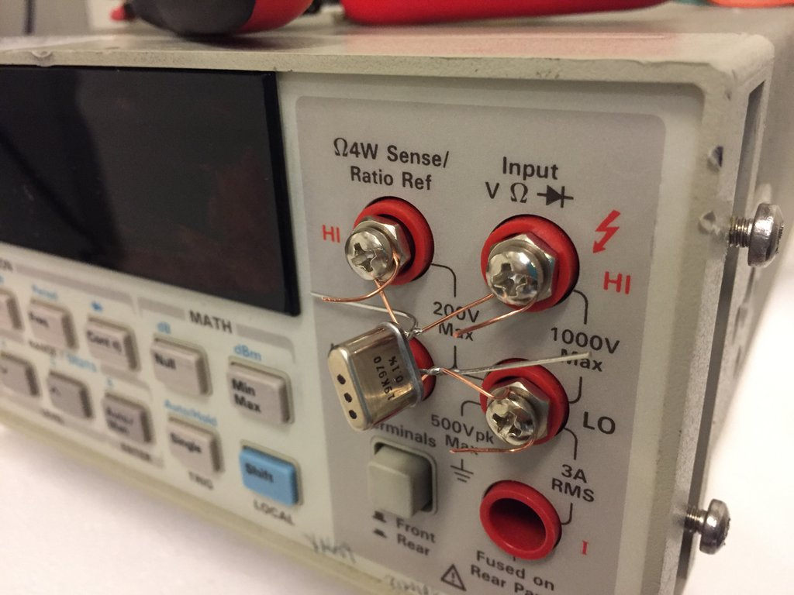

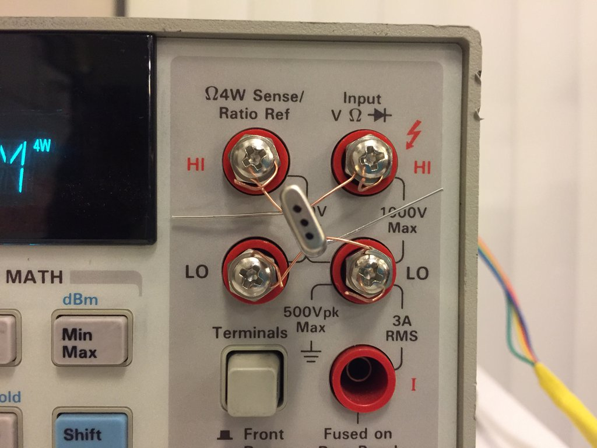

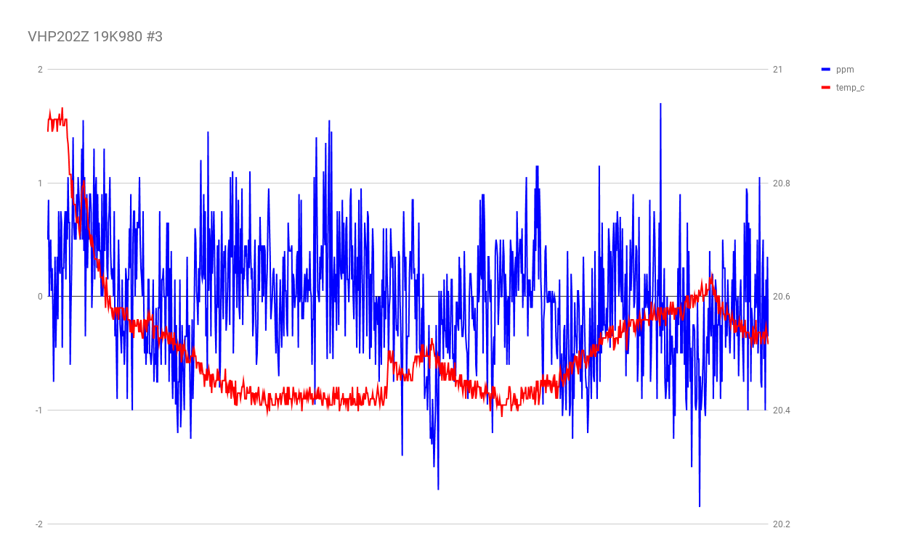

here we see the noisy ppm result I was expecting.

## run 3: AE XB 25K000

this sits at 25% of the ADC's range, so we expect the ppm noise to be slightly better than the 19K970.

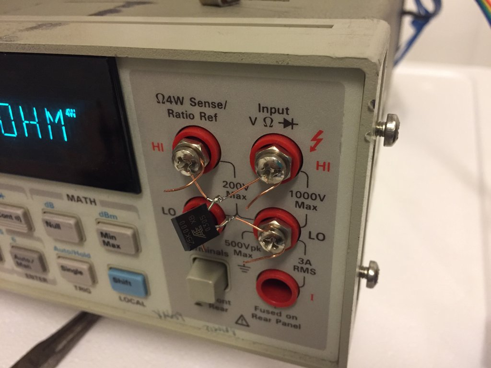

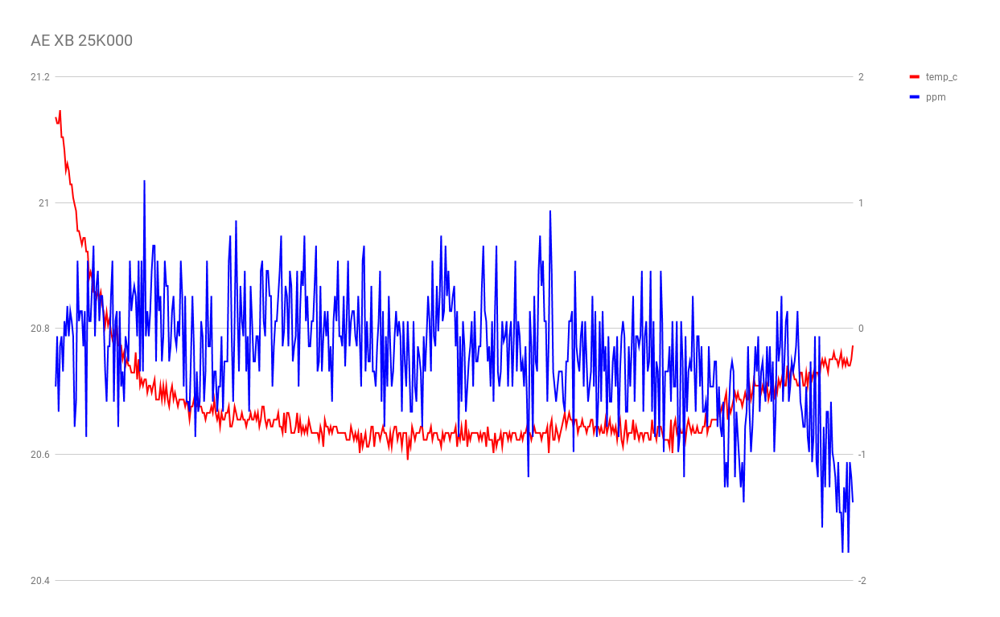

## run 4: Vishay S102K 30K000

this sits at 30% of the ADC's range, so ppm's should be veeeery slightly less noisy than the 25k.

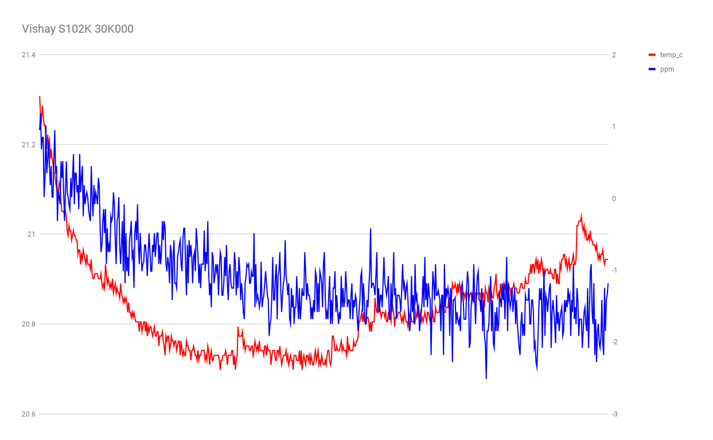

## run 5: Vishay VSRJ 50K000

50% of the ADC's range, yadda yadda yadda...

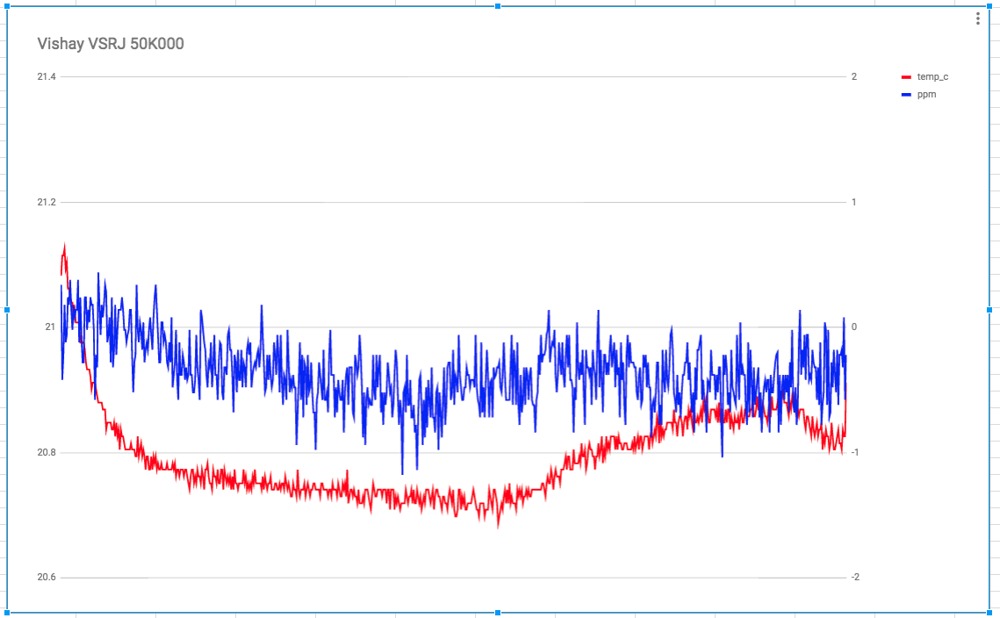

## run 6: TDK 80K000

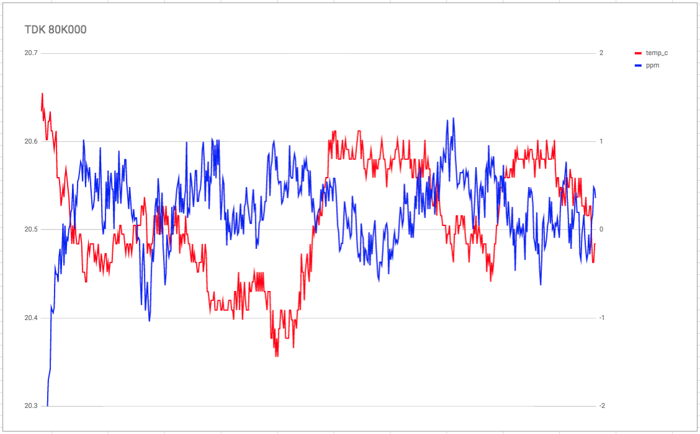

I started cooking dinner here, and the equipment is currently in the kitchen, so the temperature is a little drifty here.

## run 7: S102C 100K000

we expect this result to be very good, because it is near the top of the ADC's range.

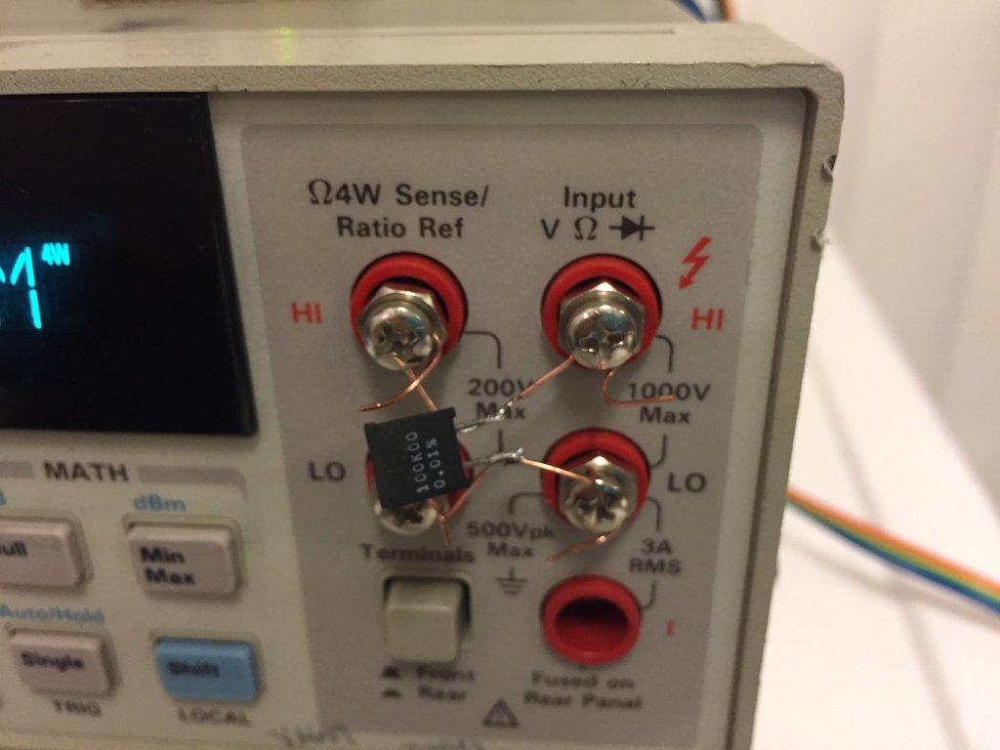

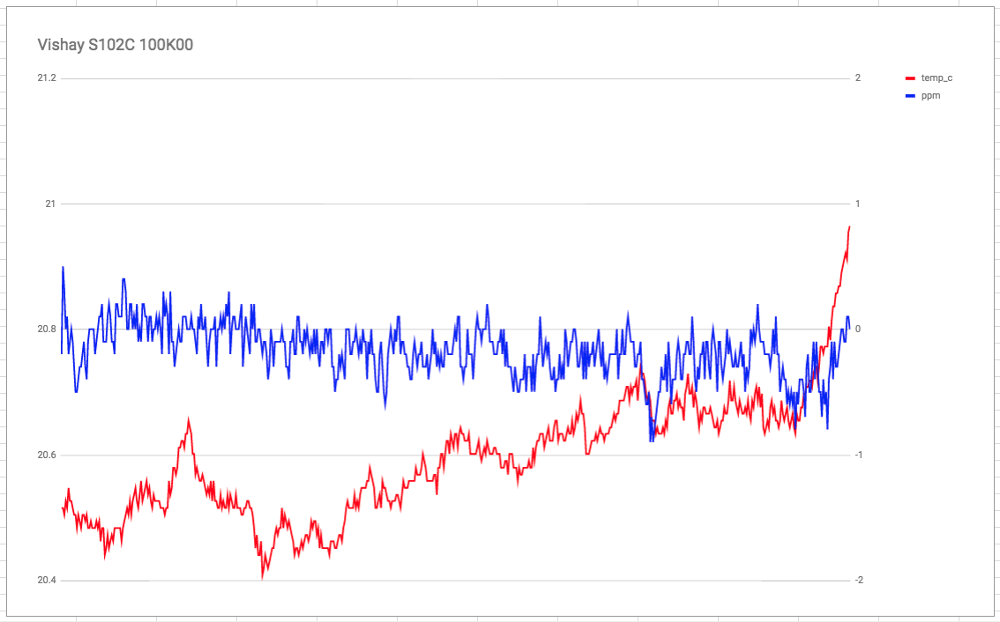

hmm, I had expected this to be cleaner.

## finally, back where we started the other day: 9k9850 #1

we expect this result to be very good, because it is near the top of the ADC's range.

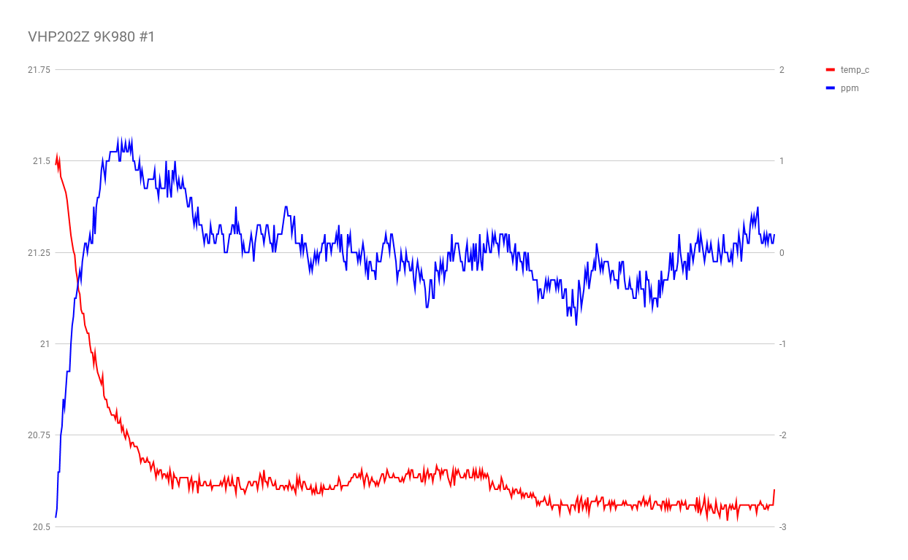
