revisiting the tuning on my TEC chamber.

## run1

- supply: 12V
- p: 7.0
- i: 0.75
- d: 0.5
- period: 1000ms
- output limit: 65 (~1000mA)
- program: 60s @25C, 60s @26C

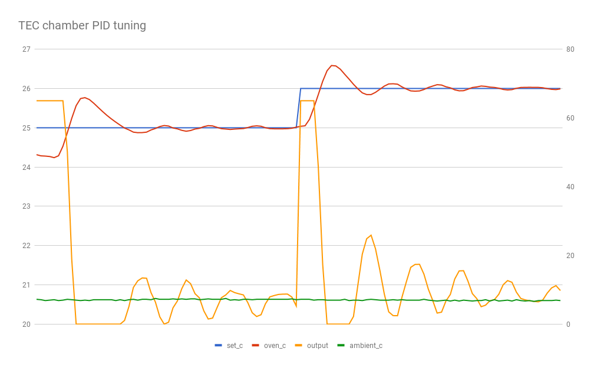

## run2

- supply: 12V
- p: 7.0
- i: 0.0
- d: 0.0
- period: 1000ms
- output limit: 65 (~1000mA)
- program: 60s @25C, 60s @26C

## run3

- supply: 12V
- p: 5.0
- i: 0.0
- d: 0.0
- period: 1000ms
- output limit: 65 (~1000mA)
- program: 60s @25C, 60s @26C

## run4

- supply: 12V
- p: 4.0
- i: 0.0
- d: 0.0
- period: 1000ms
- output limit: 65 (~1000mA)
- program: 60s @25C, 60s @26C

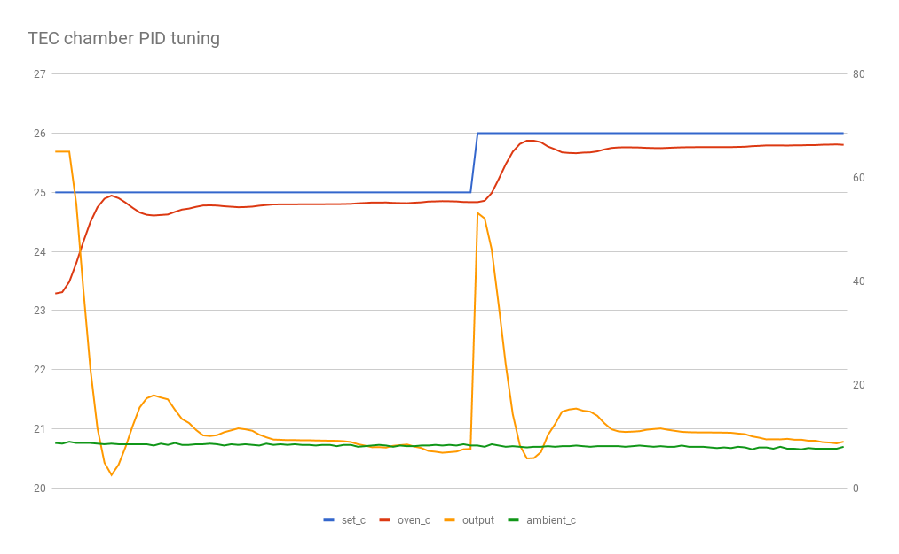

## run5

- supply: 12V
- p: 4.0
- i: 0.1
- d: 0.0
- period: 1000ms
- output limit: 65 (~1000mA)
- program: 60s @25C, 60s @26C

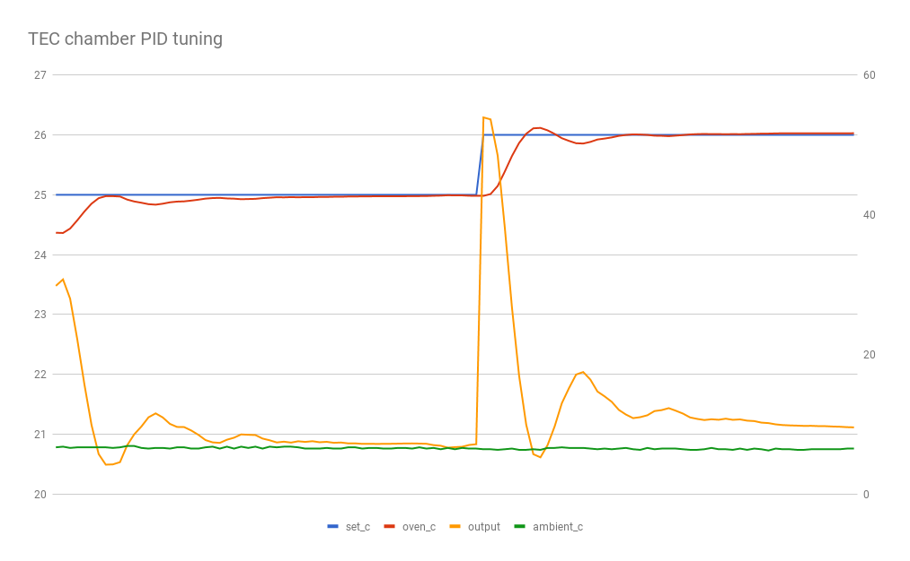

## run6

- supply: 12V
- p: 4.0
- i: 0.2
- d: 0.0
- period: 1000ms
- output limit: 65 (~1000mA)
- program: 60s @25C, 60s @26C

## run7

- supply: 12V
- p: 4.0
- i: 0.4
- d: 0.0
- period: 1000ms
- output limit: 65 (~1000mA)
- program: 60s @25C, 60s @26C

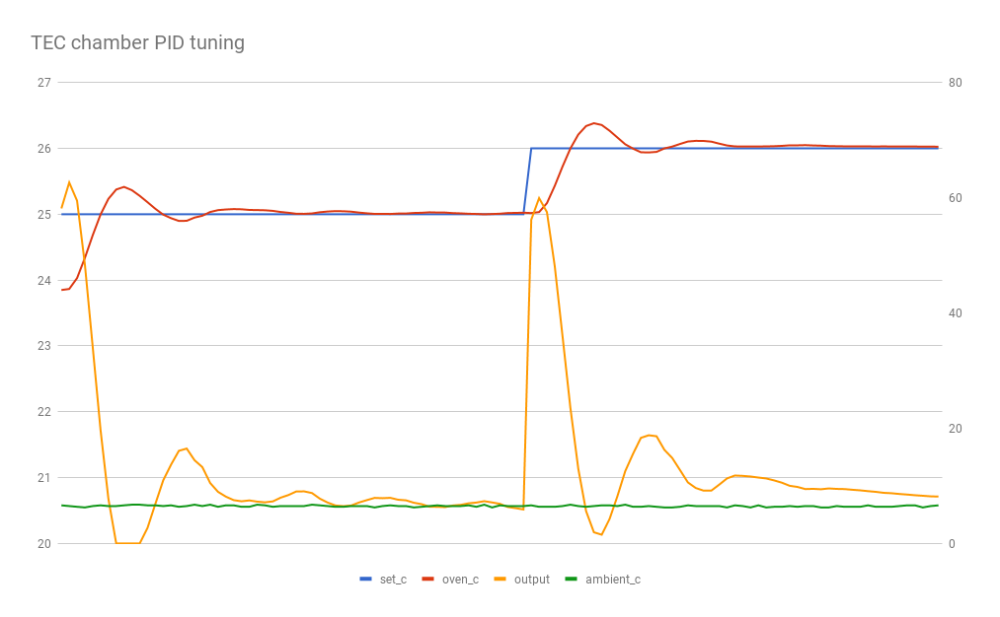

## run8

- supply: 12V
- p: 4.0
- i: 0.4
- d: 0.1
- period: 1000ms
- output limit: 65 (~1000mA)
- program: 60s @25C, 60s @26C

## run9

- supply: 5V
- p: 4.0
- i: 0.4
- d: 0.1
- period: 1000ms
- output limit: 65 (~360mA)
- program: 60s @25C, 60s @26C

## run10

- supply: 5V
- p: 4.0
- i: 0.0
- d: 0.0
- period: 1000ms
- output limit: 205 (~1000mA)
- program: 60s @25C, 60s @26C

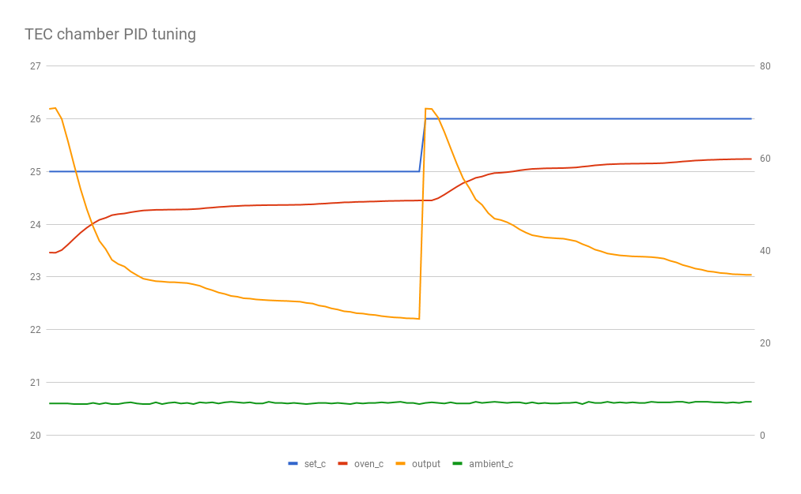

## run11

- supply: 5V
- p: 8.0
- i: 0.0
- d: 0.0
- period: 1000ms
- output limit: 205 (~1000mA)
- program: 60s @25C, 60s @26C

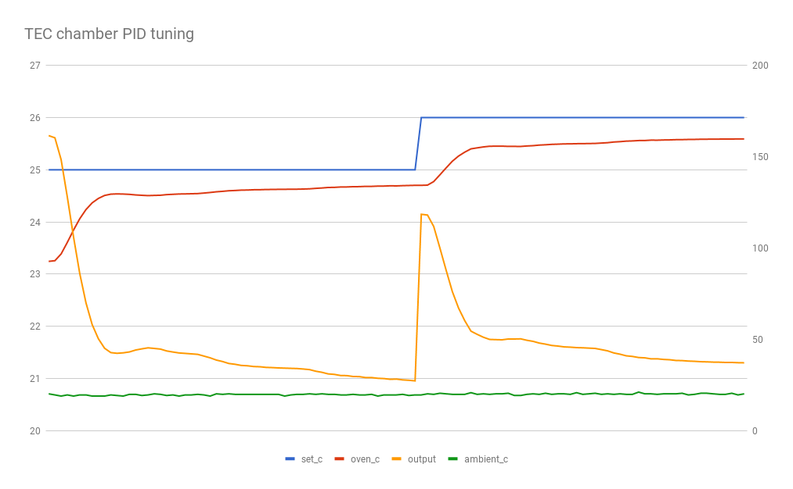

## run12

- supply: 5V
- p: 16.0
- i: 0.0
- d: 0.0
- period: 1000ms
- output limit: 205 (~1000mA)
- program: 60s @25C, 60s @26C

## run13

- supply: 5V
- p: 16.0
- i: 0.1
- d: 0.0
- period: 1000ms
- output limit: 205 (~1000mA)
- program: 60s @25C, 60s @26C

## run14

- supply: 5V
- p: 16.0
- i: 0.25
- d: 0.0
- period: 1000ms
- output limit: 205 (~1000mA)
- program: 60s @25C, 60s @26C

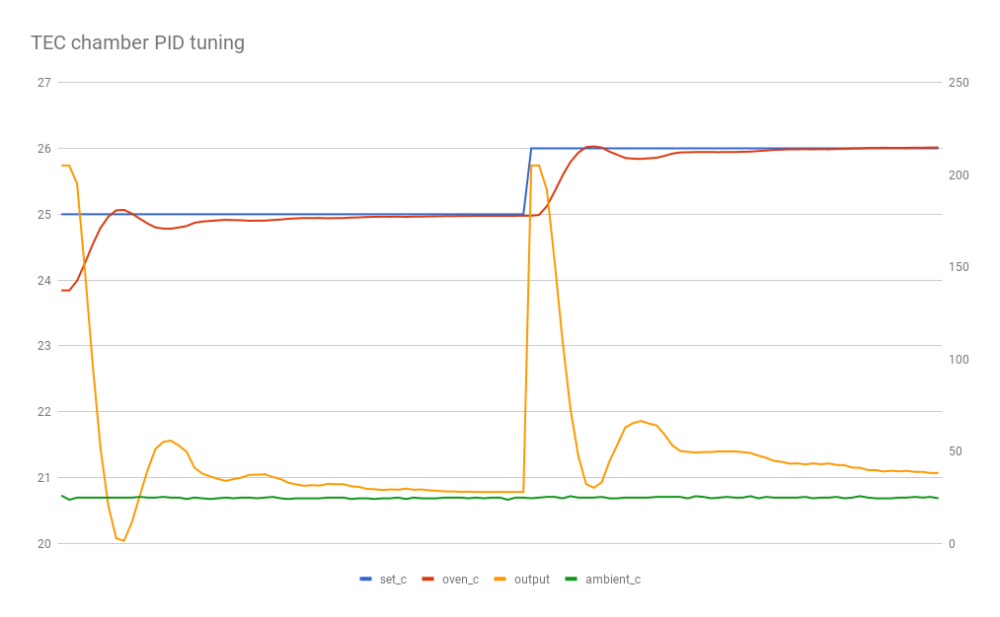

## run15

- supply: 5V
- p: 16.0
- i: 0.5
- d: 0.0
- period: 1000ms
- output limit: 205 (~1000mA)
- program: 60s @25C, 60s @26C

## run16

- supply: 5V
- p: 16.0
- i: 1.0
- d: 0.0
- period: 1000ms
- output limit: 205 (~1000mA)
- program: 60s @25C, 60s @26C

## run17

- supply: 5V
- p: 16.0
- i: 2.0
- d: 0.0
- period: 1000ms
- output limit: 205 (~1000mA)
- program: 60s @25C, 60s @26C

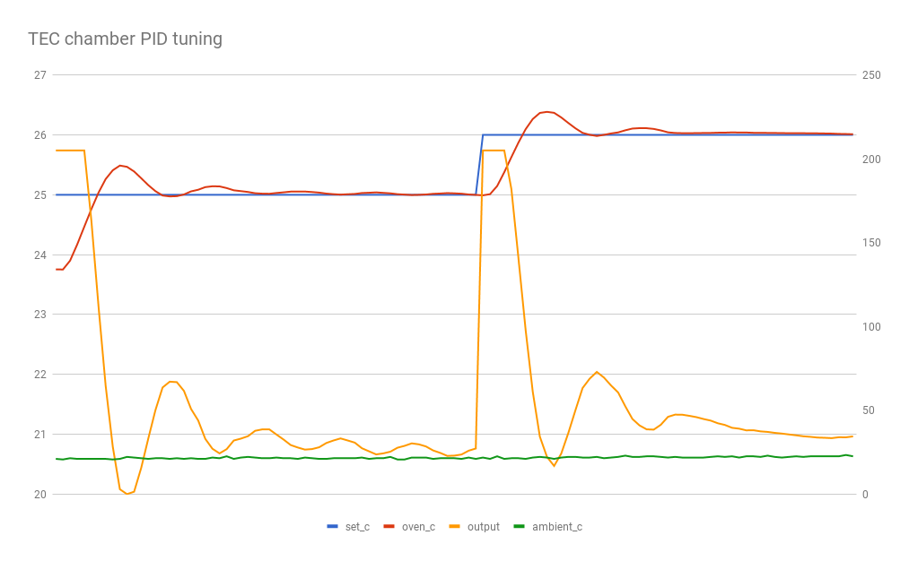

## run18

- supply: 5V
- p: 16.0
- i: 2.0
- d: 0.1
- period: 1000ms
- output limit: 205 (~1000mA)
- program: 60s @25C, 60s @26C

## run19

- supply: 5V
- p: 16.0
- i: 2.0
- d: 0.2
- period: 1000ms
- output limit: 205 (~1000mA)
- program: 60s @25C, 60s @26C

## run20

- supply: 5V
- p: 16.0
- i: 2.0
- d: 0.4
- period: 1000ms
- output limit: 205 (~1000mA)
- program: 60s @25C, 60s @26C

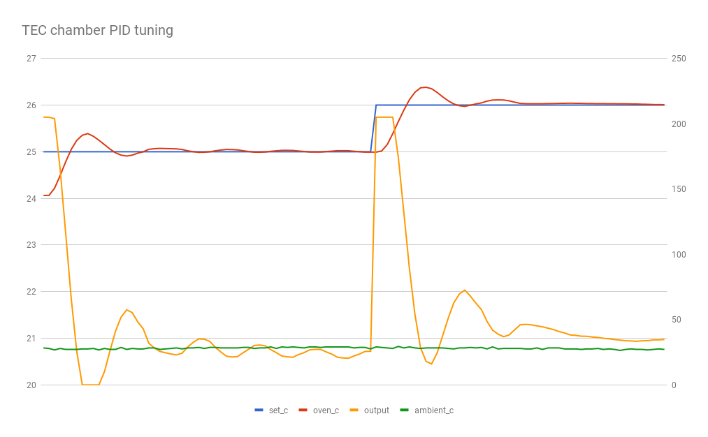

## run21

- supply: 5V
- p: 16.0
- i: 2.0
- d: 0.8
- period: 1000ms
- output limit: 205 (~1000mA)
- program: 60s @25C, 60s @26C

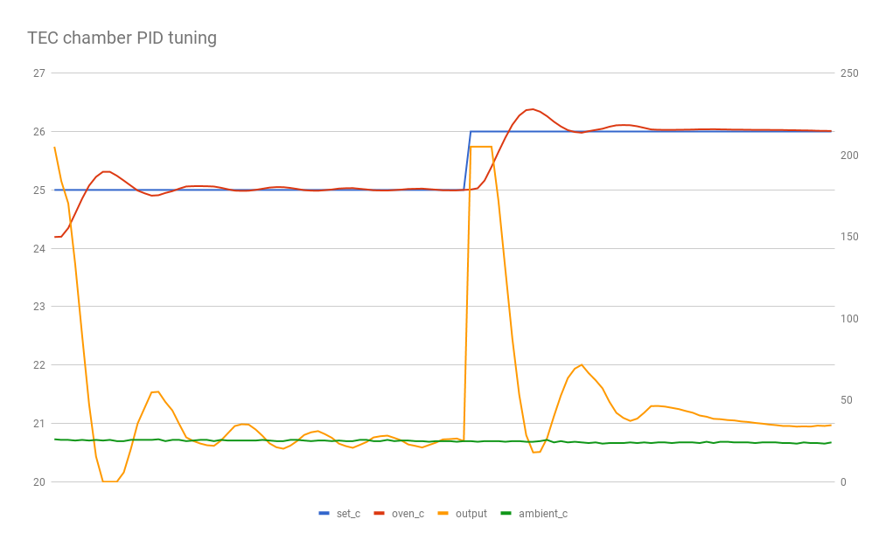

## run22

- supply: 5V
- p: 16.0
- i: 2.0
- d: 1.6
- period: 1000ms
- output limit: 205 (~1000mA)
- program: 60s @25C, 60s @26C

## run23

- supply: 5V
- p: 16.0
- i: 2.0
- d: 3.2
- period: 1000ms
- output limit: 205 (~1000mA)
- program: 60s @25C, 60s @26C

## run24

- supply: 5V
- p: 16.0
- i: 2.0
- d: 6.4
- period: 1000ms
- output limit: 205 (~1000mA)
- program: 60s @25C, 60s @26C

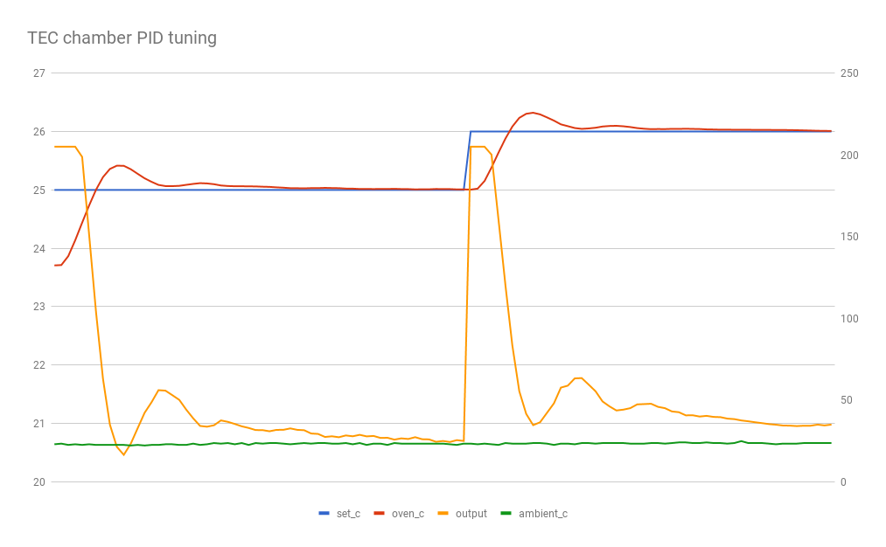

## run25

- supply: 5V
- p: 16.0
- i: 2.0
- d: 12.8
- period: 1000ms
- output limit: 205 (~1000mA)
- program: 60s @25C, 60s @26C

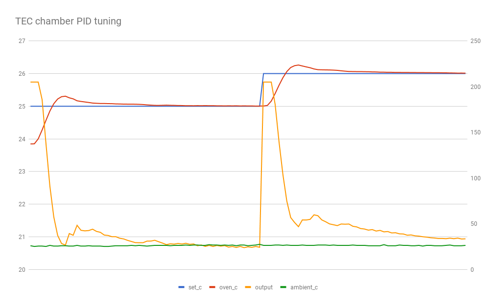

## run26

- supply: 5V
- p: 16.0
- i: 2.0
- d: 25.6
- period: 1000ms
- output limit: 205 (~1000mA)
- program: 60s @25C, 60s @26C

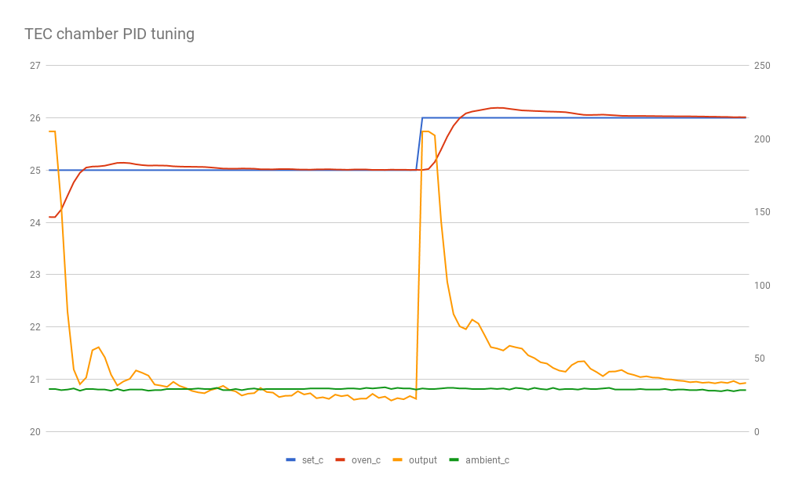

## run27

- supply: 5V
- p: 16.0
- i: 2.0
- d: 51.2
- period: 1000ms
- output limit: 205 (~1000mA)
- program: 60s @25C, 60s @26C

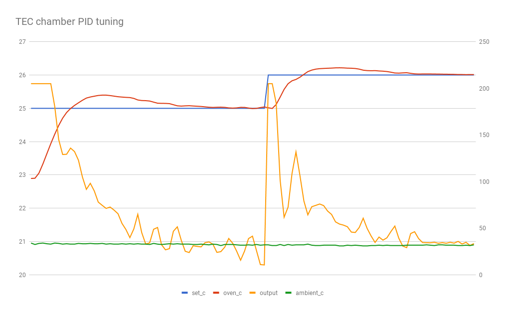

## run28

- supply: 5V
- p: 32.0
- i: 0.0
- d: 0.0
- period: 1000ms
- output limit: 205 (~1000mA)
- program: 60s @25C, 60s @26C

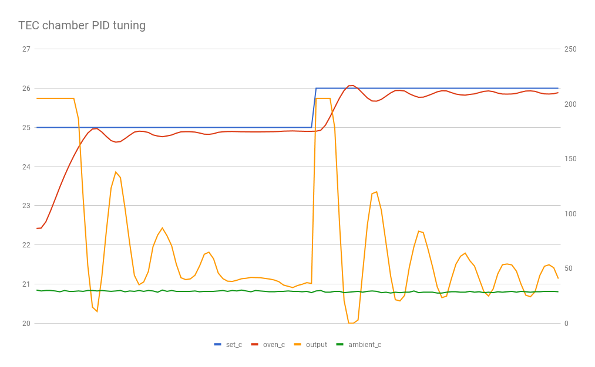

## run29

- supply: 5V
- p: 32.0
- i: 0.0
- d: 2.0
- period: 1000ms
- output limit: 205 (~1000mA)
- program: 60s @25C, 60s @26C

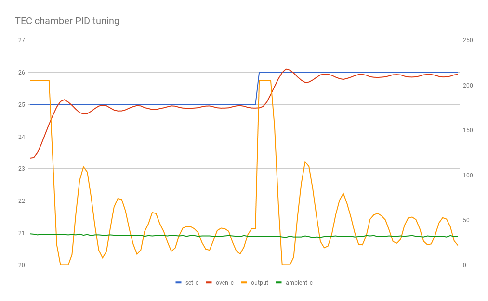

## run30

- supply: 5V
- p: 32.0
- i: 0.0
- d: 4.0
- period: 1000ms
- output limit: 205 (~1000mA)
- program: 60s @25C, 60s @26C

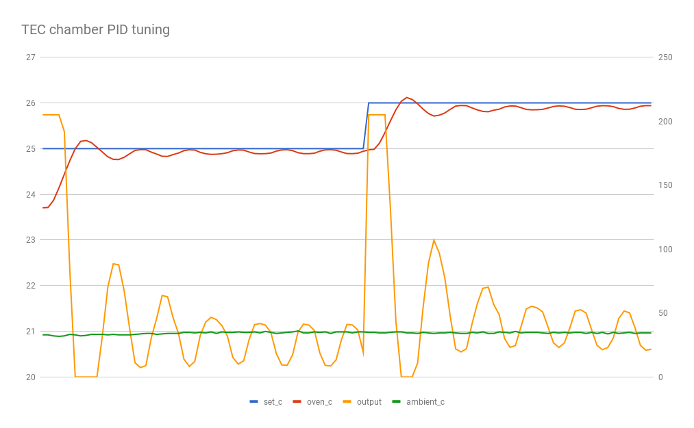

## run31

- supply: 5V
- p: 32.0
- i: 0.0
- d: 8.0
- period: 1000ms
- output limit: 205 (~1000mA)
- program: 60s @25C, 60s @26C

## run32

- supply: 5V
- p: 32.0
- i: 0.0
- d: 16.0
- period: 1000ms
- output limit: 205 (~1000mA)
- program: 60s @25C, 60s @26C

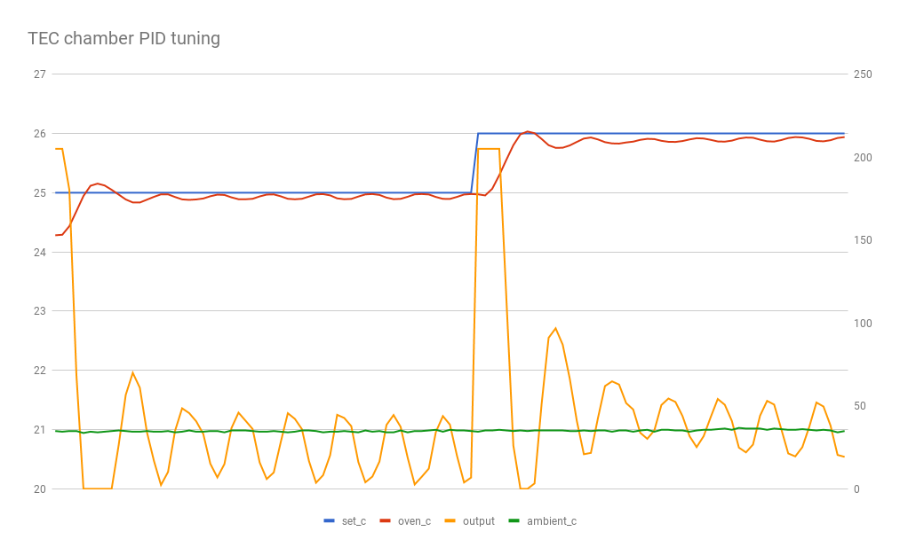
