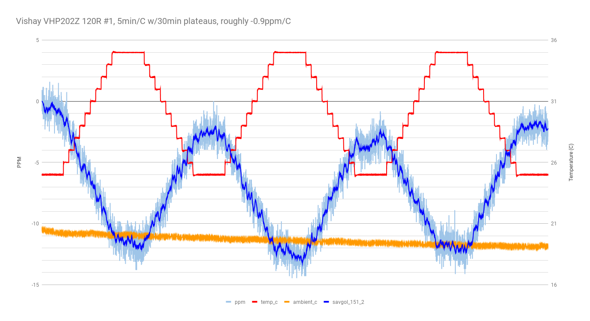
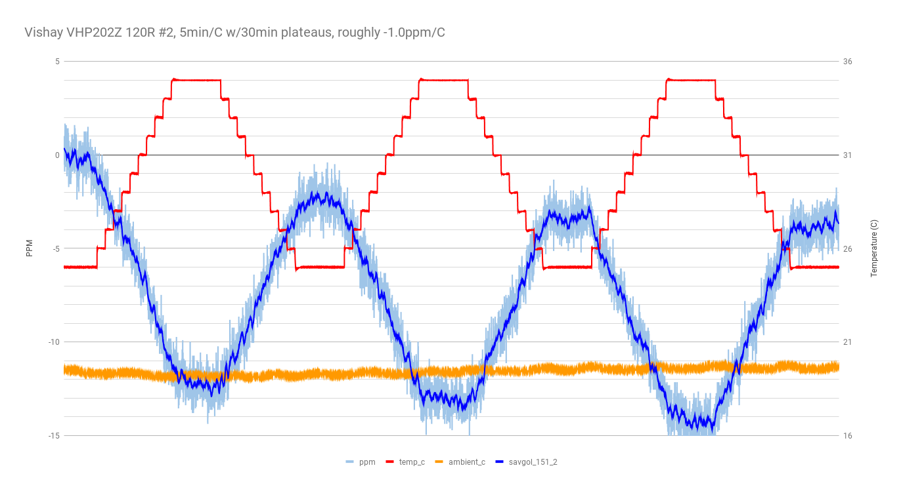
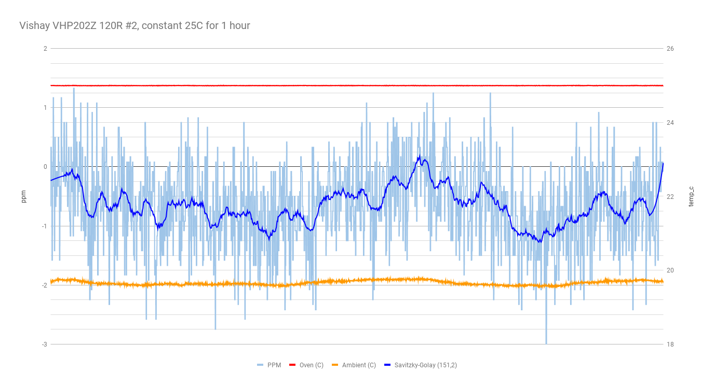
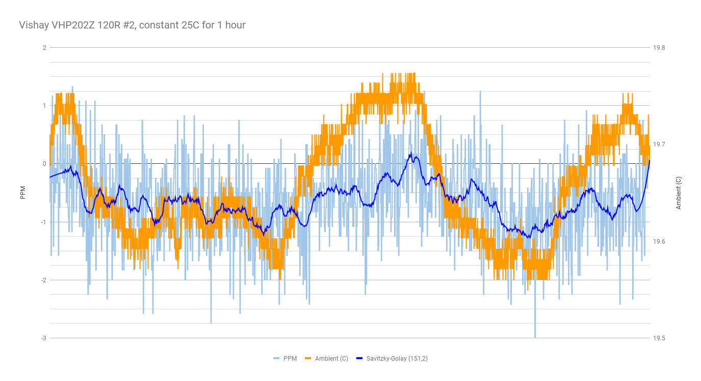

more 4-wire mode with DUT in the TEC chamber, ramping from 25C to 35C, etc.

- meter: 34401A in 4-wire mode.
- chamber: Hammond 1590A with 12706 peltier, Arduino-based half-bridge controller.
- power supply set to 5V.
- each step is 1C and 5 minutes, with 30 minute plateaus at 25C and 35C.

## run 1

VHP202Z 70K #2

25C to 35C ramp in 1C steps, 5min/step.

this was an extended (~8 hour) run with multiple ramps up and down.

Si7021 records ambient temperature.

about -0.6ppm/C, very similar to VHP202Z 70K #1.

## run 2

VHP202Z 70K #3

similar, maybe -0.45ppm/C, but it is hard to tell because the signal is either slowly shifting or I am seeing some hystersis.  I'll try another run and see if it settles down.

## run 3

VHP202Z 120R #1

I had anticipated that the 120R result would be much noisier (it is very low in the ADC's range), and was pleasantly surprised to see a useful result.

The signal does appear to be wandering, moreso than with the 70K resistors.  Again, I'm not sure if this is the meter wandering, or if this represents actual hystersis of the resistor.  Performing a multi-day run with perhaps 10 ramps up and down would be useful.

## run 4

VHP202Z 120R #2

## run 5

VHP202Z 120R #2

ok, let's see if we can get a handle on the drift of the meter / system-as-a-whole.

let's just maintain 25C for one hour and see what we get.

ok, so that accounts for at least some of the "wandering" I'm seeing in the above charts.  good to know.

here's the same chart with the ambient variance zoomed-in.

## run 6

VHP202Z 120R #2

starting a longer run (7 up/down cycles, ~19 hours).

oops, after 127 steps the program got stuck, because I used an int8_t.  drat.

