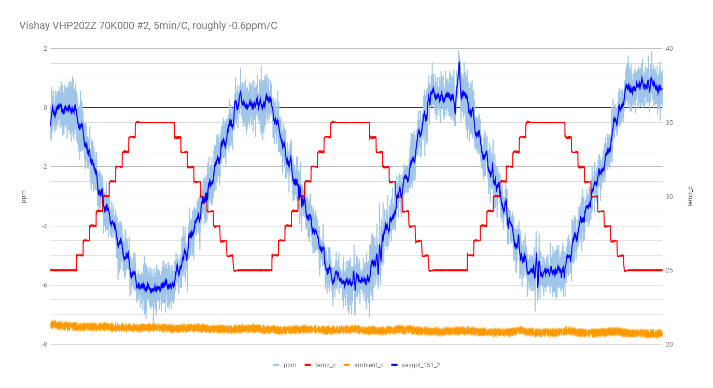

more 4-wire mode with DUT in the TEC chamber, ramping from 25C to 35C, etc.

- meter: 34401A in 4-wire mode.
- chamber: Hammond 1590A with 12706 peltier, Arduino-based half-bridge controller.
- power supply set to 5V.

## run 1

VHP202Z 70K #2

25C to 35C ramp in 1C steps, 5min/step.

this was an extended (~8 hour) run with multiple ramps up and down.

Si7021 records ambient temperature.

about -0.6ppm/C, very similar to VHP202Z 70K #1.

## run 2

VHP202Z 70K #3

similar, maybe -0.45ppm/C, but it is hard to tell because the signal is either slowly shifting or I am seeing some hystersis.  I'll try another run and see if it settles down.

## run 3

VHP202Z 120R #1

I had anticipated that the 120R result would be much noisier (it is very low in the ADC's range), and was pleasantly surprised to see a useful result.

The signal does appear to be wandering, moreso than with the 70K resistors.  Again, I'm not sure if this is the meter wandering, or if this represents actual hystersis of the resistor.  Performing a multi-day run with perhaps 10 ramps up and down would be useful.

