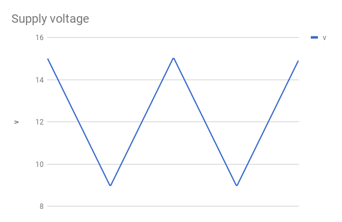
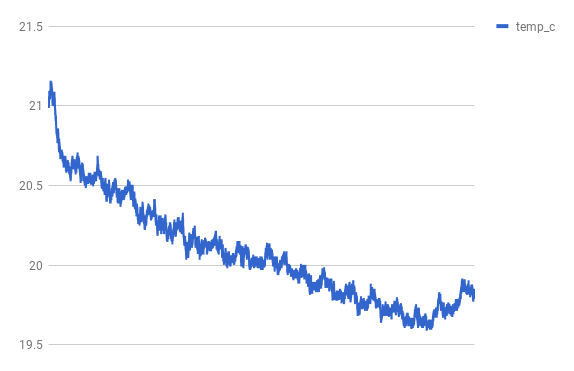
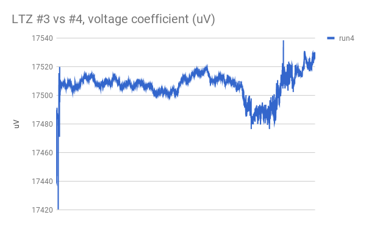
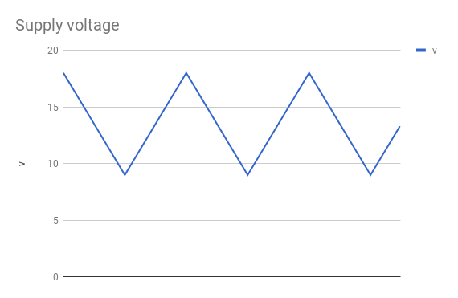
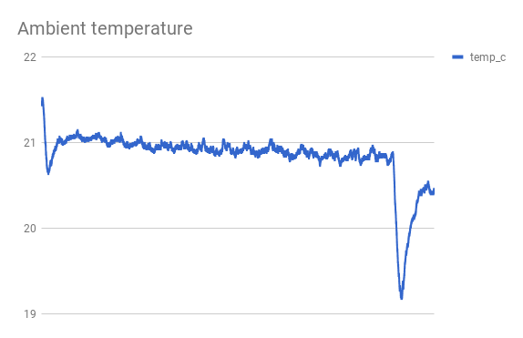

## run 1:

LTZ #3 and #4, back-to-back.

LTZ #3 powered by lipo into 7815 regulator.

LTZ #4 powered by lipo into programmable LM317.

LTZ #4 has had the input protection diode as well as the heater zener bypassed.

data acquisition: HP 34401A (slow 6-digit, 10GOhm) for voltage and Si7021 for temperature.

This was just a test run to get everything set up.

## run 2:

HP in fast 6-digit mode.

Varying LTZ #4 voltage from 9.0V to 8.0V, in steps of 0.1V every 5 seconds.

This run is to establish at what point the LTZ heater circuit falls out of regulation.

## run 3:

HP in slow 6-digit mode.

Varying LTZ #4 voltage from 15.0V to 9.0V, in steps of 0.1V every 120 seconds.

This run is to measure the PSRR of LTZ #4.

## run 4:

This time varying from 18.0V to 9.0V in 0.1V steps every 60 seconds.

I have also introduced an opto-isolator inbetween the laptop and the LM317, so the LTZ's should be floating now.  I have verified that the USB shield of the laptop is in fact connected directly to the ground terminal of my wall outlet when my laptop is plugged in.

