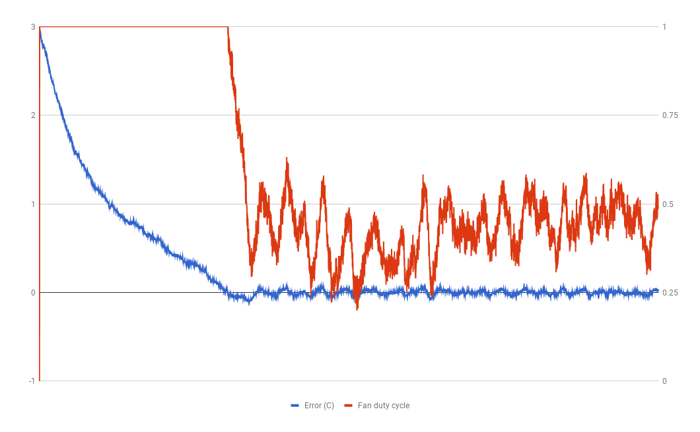

ambient temperature logs (looking for the most stable spot in my apartment).

## run 1

the bedroom, near my lamp.

## run 2

overnight in a cardboard box with a small appliance light bulb as heat source, then heat source turned off during the day while I was at work.

## run 3

same cardboard box, but with an inlet and outlet tube added (toilet paper cardboard tubes),
and a small 12V fan affixed to a tube in an exhaust configuration.

The fan was initially off, then turned on as 12V, then lowered to 4.5V (roughly the lowest starting voltage).

## run 4

Same box, same fan, but with a PID loop controlling the duty cycle of the fan.  Even with only spending 15 minutes tuning the PID, and with the relatively noisy / coarse readins of the Si7021, it was easy to get +/-0.1C.

The first chart is the first 5000 data points (roughly the first half hour), and the second chart represents over 12 hours of data.

