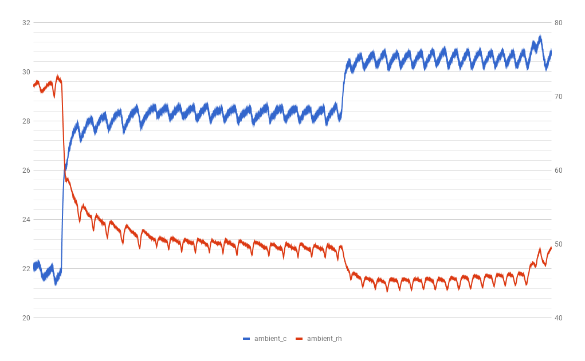
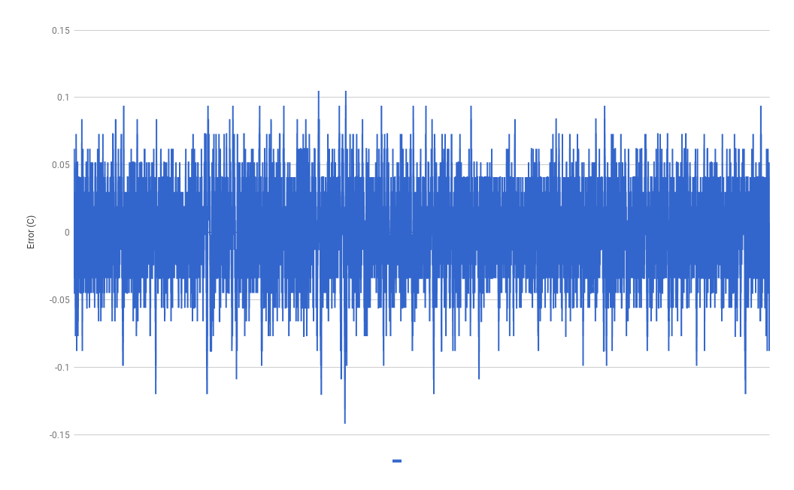
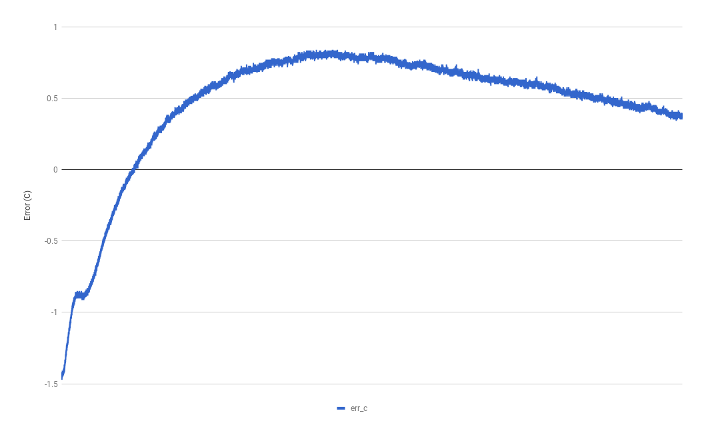
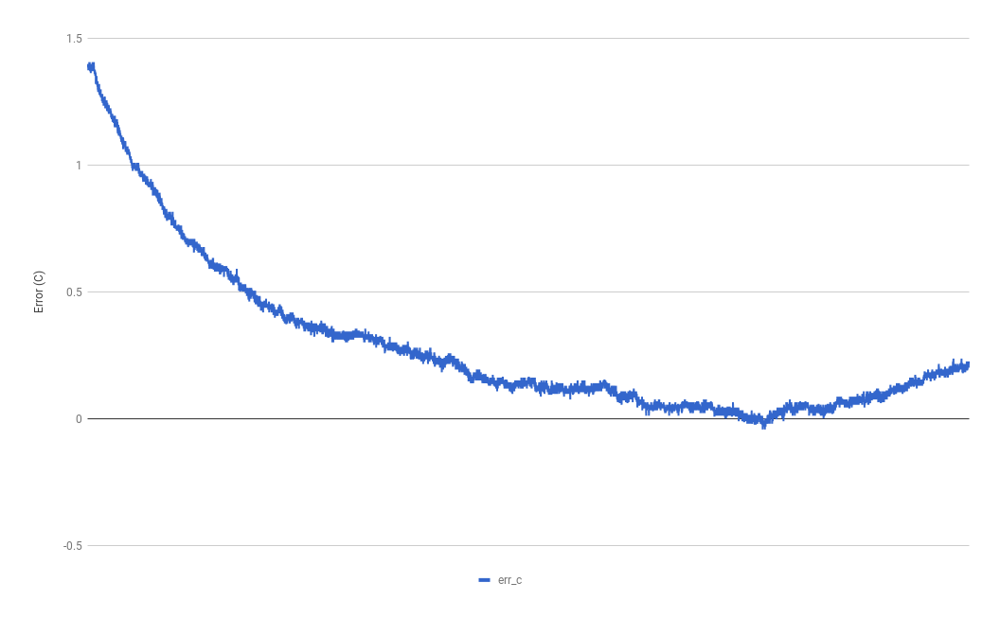

ambient temperature logs (looking for the most stable spot in my apartment).

## run 1

the bedroom, near my lamp.

## run 2

overnight in a cardboard box with a small appliance light bulb as heat source, then heat source turned off during the day while I was at work.

## run 3

same cardboard box, but with an inlet and outlet tube added (toilet paper cardboard tubes),
and a small 12V fan affixed to a tube in an exhaust configuration.

The fan was initially off, then turned on as 12V, then lowered to 4.5V (roughly the lowest starting voltage).

## run 4

Same box, same fan, but with a PID loop controlling the duty cycle of the fan.  Even with only spending 15 minutes tuning the PID, and with the relatively noisy / coarse readins of the Si7021, it was easy to get +/-0.1C.

The first chart is the first 5000 data points (roughly the first half hour), and the second chart represents over 12 hours of data.

## run 5

a short test run with the larger box, to establish a low-temperature baseline.

## run 6

an overnight test run with the meter turned on, but the fan turned off (to see the temp rise).

## run 7

PID set to 24C.

couldn't quite make that.

## run 8

PID set to 24.5C.

## run 9

FIXME

## run 10

added another Si7021 to sense ambient temp outside of the box.

PID set to 25C.

still had two instances of the fan speed running away.  not sure what is causing that.  at the same time, the values from the outside temp sensor are a perfectly flat line.  hrmm...

## run 11

lowering kp from 500 to 250.

## run 12

switching to a mosfet-based linear fan control.  pwm drives a low-pass filter to the gate of a 2N7000, which is in series with the fan.

* kp 200
* ki 10
* kd 0

internal Si7021 is 9x oversampled, external sampled once per loop, which is about a 2 second loop (takes about 202ms to read from the Si7021).

## run 13

* kp 200
* ki 5
* kd 0

## run 14

* kp 1000
* ki 0
* kd 0

## run 15

* kp 2000
* ki 0
* kd 0

## run 16

* kp 4000
* ki 0
* kd 0

## run 17

* kp 500
* ki 0
* kd 0
